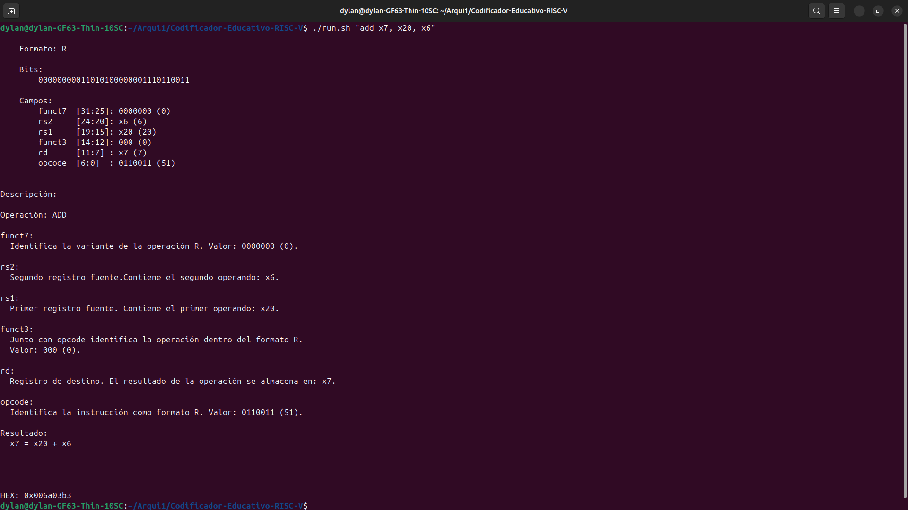
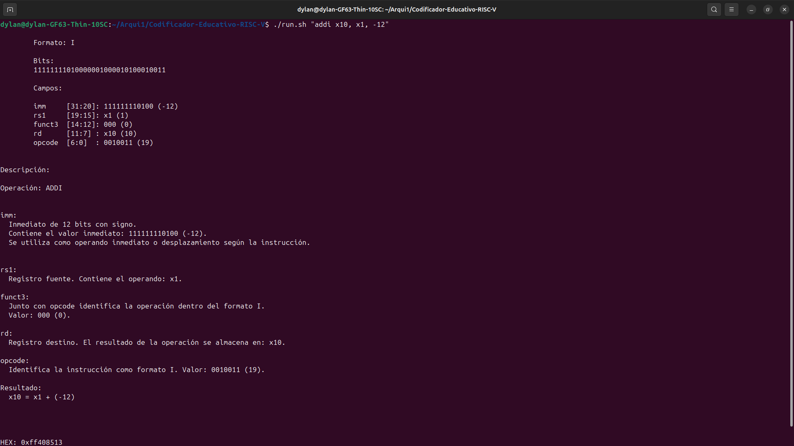
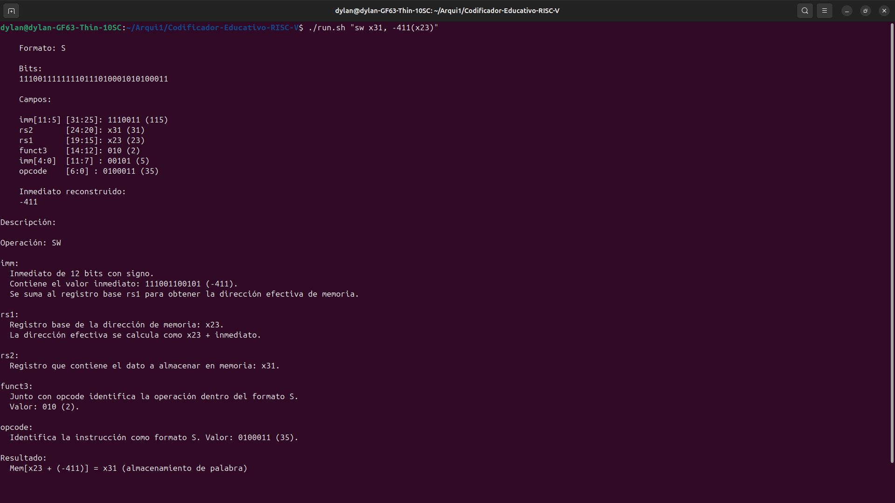
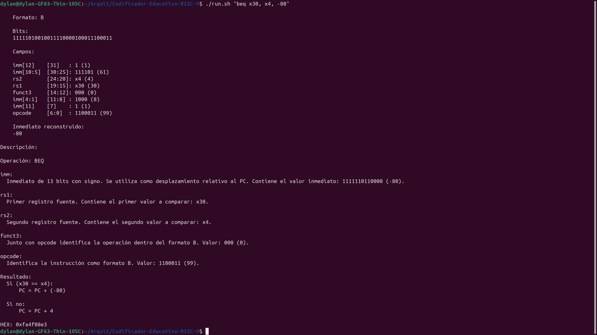

# Documentación Técnica

## 1. Arquitectura del código y decisiones de diseño

El código está estructurado en diferentes componentes que separan las etapas
de análisis, codificación, decodificación y explicación de una instrucción
RISC-V.

[Documentación Técnica del proyecto](https://github.com/Kasyrgan04/Codificador-Educativo-RISC-V/blob/402883848c285810c27ee58480199452b61e032c/Documentacion_Tecnica.md)

La organización del repositorio es la siguiente:

### Estructura del repositorio
---

La organización del proyecto se divide en módulos de implementación,
validación y documentación. La estructura principal es la siguiente:

```text
Codificador-Educativo-RISC-V/
│
├── imgs/
│   ├── R-type.png
│   ├── I-type.png
│   ├── S-type.png
│   └── B-type.png
│
├── validaciones/
│   ├── test_vectors.py
│   ├── validate_toolchain.py
│   ├── validacion_toolchain.txt
|   ├── vectores_ejemplo.txt
│   └── validacion_vectores.txt
|
├── encoder_skeleton.py
├── run.sh 
│
├── Documentacion_Tecnica.md
├── README.md
├── especificacion-proyecto-individual-isa-encoder-risc-v.pdf
└── LICENSE
```

### Descripción de archivos y carpetas
---

- **`encoder_skeleton.py`**  
  Contiene la implementación principal del codificador, decodificador y
  generador de explicaciones de instrucciones RISC-V.

- **`run.sh`**  
  Script auxiliar para ejecutar la herramienta desde la terminal utilizando
  una instrucción en formato ensamblador.

- **`validaciones/`**  
  Contiene los scripts utilizados para comprobar el funcionamiento de la
  implementación.

  - `test_vectors.py`: ejecuta la validación utilizando los vectores de prueba
    proporcionados y compara el HEX esperado contra el generado por la
    herramienta.

  - `validate_toolchain.py`: realiza la comparación contra el toolchain GNU
    RISC-V mediante ensamblado y desensamblado de instrucciones.

  - `validacion_toolchain.txt`: contiene la salida generada por la validación
    contra el toolchain como evidencia de las pruebas realizadas.

- **`imgs/`**  
  Contiene imágenes de referencia utilizadas en la documentación para mostrar
  la distribución de campos de los formatos de instrucción R, I, S y B.

- **`vectores_ejemplo.txt`**  
  Archivo con los casos de prueba utilizados para validar la codificación de
  instrucciones.

- **`validacion_vectores.txt`**  
  Resultado generado por la ejecución de las pruebas con vectores de ejemplo.

- **`README.md`**  
  Contiene las instrucciones necesarias para preparar el entorno y ejecutar
  el proyecto.

- **`Documentacion_Tecnica.md`**  
  Documento con la descripción de la arquitectura del código, decisiones de
  diseño, funcionamiento interno y resultados de validación.

- **`especificacion-proyecto-individual-isa-encoder-risc-v.pdf`**  
  Documento de referencia utilizado para implementar los formatos de
  instrucciones y requisitos del proyecto.

### Organización principal del código:
---

### Parser de instrucciones
---
Encargado de transformar la entrada de texto en una estructura manejable
por el programa. El procesamiento de registros e inmediatos se realiza mediante funciones
auxiliares que permiten convertir la representación textual de los operandos
a valores numéricos utilizados durante la codificación.

Funciones principales:

- `parse_instruction()`
  - Separa el mnemónico y los operandos de la instrucción.
  - Permite identificar instrucciones como:
    - `add x5, x6, x7`
    - `lw x10, -12(x3)`

- `parse_register()`
  - Convierte un registro escrito como `x5` en su representación numérica.

- `parse_memory_operand()`
  - Procesa operandos de memoria con formato:
    ```
    desplazamiento(registro)
    ```
    Ejemplo:
    ```
    -411(x23)
    ```
    separándolo en inmediato y registro base.

- `immediate_bits()`
  - Obtiene la representación en complemento a dos de un inmediato para
    almacenarlo dentro del número de bits requerido por cada formato.

- `sign_extend()`
  - Permite recuperar el valor con signo de un campo inmediato extraído de
    una instrucción.
  - Es utilizado durante la decodificación para interpretar correctamente
    inmediatos negativos.
  - Ejemplo:
    ```
    111111110100₂ → -12
    ```


### Tabla de instrucciones
---
La información de codificación de cada instrucción se mantiene en una
estructura de datos que contiene:

- Formato de instrucción.
- Opcode.
- Funct3.
- Funct7 (cuando aplica).

Esta tabla permite que el encoder sea dinámico y no dependa de casos
particulares de entrada.


### Encoder
---
El encoder genera la palabra de 32 bits correspondiente a una instrucción
RISC-V a partir del mnemónico y sus operandos previamente procesados.

Funciones principales:

- `encode_R()`
- `encode_I()`
- `encode_S()`
- `encode_B()`

Cada función implementa la codificación específica de su formato de
instrucción, colocando los campos en sus posiciones correspondientes dentro
de la palabra de 32 bits mediante operaciones de desplazamiento y máscaras
de bits.


### Decoder
---
El decoder realiza la operación inversa: extrae los campos de una palabra de 32 bits.

Funciones principales:

- `decode_R()`
- `decode_I()`
- `decode_S()`
- `decode_B()`

Estas funciones recuperan registros, inmediatos, opcode y campos funct.


### Generador de explicación
---
El generador de explicación produce una salida legible para el usuario a
partir de una instrucción codificada. Esta etapa combina la extracción de
campos realizada por el decoder con una descripción del significado de cada
campo según la instrucción.

Funciones principales:

- `explain_R()`
- `explain_I()`
- `explain_S()`
- `explain_B()`

Estas funciones reciben la palabra de 32 bits de la instrucción, obtienen sus
campos mediante el decoder correspondiente y generan la explicación completa
del formato utilizado.

Funciones de descripción:

- `describe_R()`
- `describe_I()`
- `describe_S()`
- `describe_B()`

Estas funciones interpretan los campos extraídos y explican el rol de cada
uno dependiendo de la instrucción específica, incluyendo registros fuente,
registro destino, inmediatos y operación realizada.


### Punto de entrada
---
El archivo principal recibe la instrucción desde la línea de comandos,
ejecuta el proceso de codificación y genera la salida requerida.

El script `run.sh` funciona como punto de entrada único del proyecto y se
encarga de ejecutar la herramienta.

### Decisiones de diseño
---
- Se separaron las funciones de parseo, codificación, decodificación y explicación para mantener responsabilidades independientes y favorecer la modularidad del código.

- Las funciones de descripción se encuentran separadas de las funciones de explicación. De esta forma, al añadir nuevas instrucciones, únicamente es necesario modificar estas, haciendo el código más modular.

- Cada formato de instrucción posee su propio encoder y decoder debido a las diferencias en la distribución de sus campos dentro de la palabra de 32 bits.

- Los inmediatos se manejan utilizando representación en complemento a dos para permitir el uso de valores positivos y negativos.

- Se utiliza un extensor de signo durante la decodificación para recuperar correctamente el valor original de los inmediatos con signo.

- Se emplean máscaras de bits para conservar únicamente los bits correspondientes a cada campo de la instrucción durante los procesos de codificación y decodificación.

- La información de `opcode`, `funct3` y `funct7` se mantiene separada de la lógica de codificación para facilitar la extensión del conjunto de instrucciones soportadas.

## 2. Fuente de los campos de codificación

Los valores de los campos de codificación utilizados por la herramienta,
como `opcode`, `funct3` y `funct7`, fueron obtenidos del manual oficial de
la arquitectura RISC-V.

La referencia consultada fue:

[1] A. Waterman and K. Asanović, *The RISC-V Instruction Set Manual,
Volume I: User-Level ISA, Document Version 20191213*, RISC-V Foundation,
2019.

## 3. Ejemplos de salida explicativa

### Instrucciones tipo R

### Instrucciones tipo I

### Instrucciones tipo S

### Instrucciones tipo B


## 4. Validación contra toolchain RISC-V

La validación del codificador se realizó utilizando el toolchain GNU RISC-V
mediante `riscv64-unknown-elf-as` y `riscv64-unknown-elf-objdump`.

Se utilizaron 36 casos de prueba críticos correspondientes a las 12
instrucciones soportadas. Los casos incluyen registros límite, valores
extremos de inmediatos y desplazamientos positivos y negativos en
instrucciones de salto.

Para evitar modificaciones automáticas del ensamblador se utilizó la opción:

```bash
-mno-relax
```
Esta instrucción le indica al compilador que desactive las optimizaciones.

La salida del script se guardó en **validaciones\validacion_toolchain.txt**